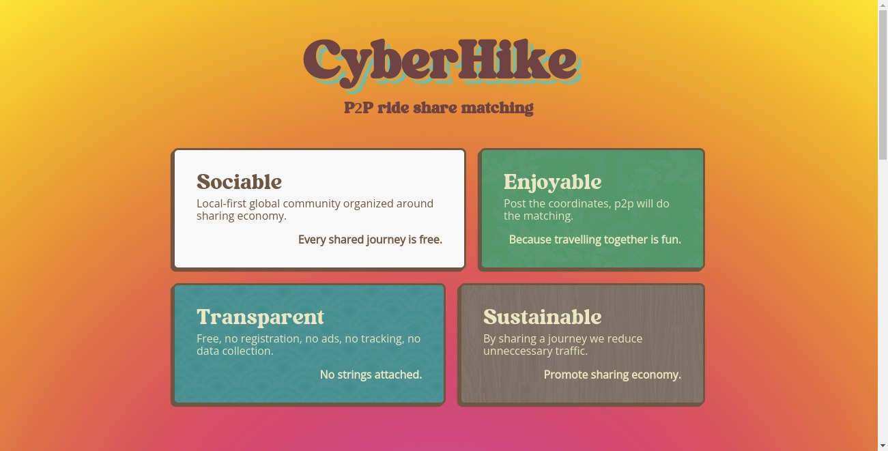
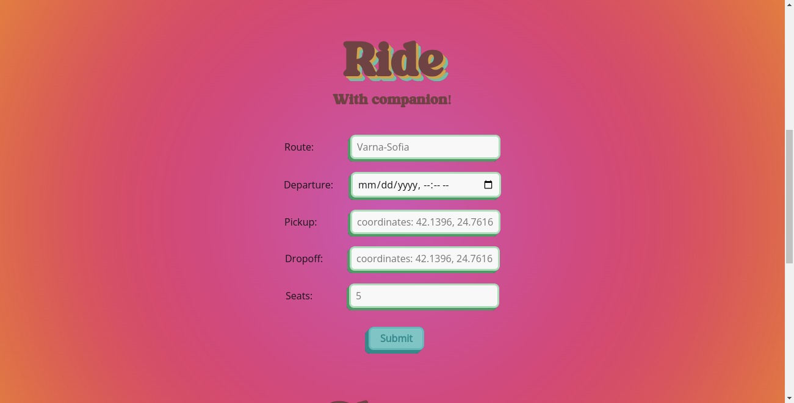
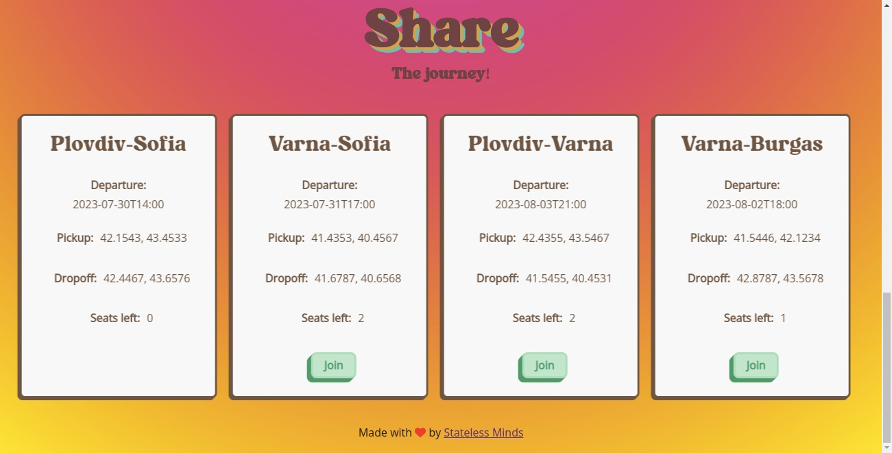

# Cyber Hike


## Ride sharing

Non-commercial ride sharing is people self-organizing via p2p apps in order to avoid corporate environment, tracking and monetization.

## How does it work?

Submit the details of your journey and post pickup,dropoff coordinates and available seats. Anyone can join anonymously until the quota is full.

## Screenshots

<a display="inline" href="./assets/home.png?raw=true">

</a>

<a display="inline" href="./assets/ride.png?raw=true">

</a>

<a display="inline" href="./assets/share.png?raw=true">

</a>

## Community

https://www.reddit.com/r/CyberHike/

## Installation

The app runs on the public IPFS network. In order to use it follow the steps below:

1. Install the official IPFS Desktop http://docs.ipfs.io/install/ipfs-desktop/
2. Install IPFS Companion http://docs.ipfs.io/install/ipfs-companion/
3. Install golang 1.20 or later version - https://go.dev/doc/install
4.  Clone https://github.com/stateless-minds/kubo to your local machine
```
git clone https://github.com/stateless-minds/kubo.git
```
5.  Follow the instructions here to open your config file: https://github.com/ipfs/kubo/blob/master/docs/config.md. Usually it's `~/.ipfs/config` on Linux. Add the following snippet to the `HTTPHeaders`:
```{
  "API": {
    "HTTPHeaders": {
      "Access-Control-Allow-Origin": ["webui://-", "http://localhost:3000", "http://k51qzi5uqu5dkn4etiu22tefi828dwrlc51hcm6kmdl8ghqsqsdddonfixhy55.ipns.localhost:8080", "http://127.0.0.1:5001", "https://webui.ipfs.io"],
      "Access-Control-Allow-Credentials": ["true"],
      "Access-Control-Allow-Methods": ["PUT", "POST"]
    }
  },
 ```
6. Build it and start the daemon:
``` 
cd kubo
make build
./cmd/ipfs/ipfs daemon --enable-pubsub-experiment
```
7.  Navigate to <a href="https://ipfs.io/ipns/k51qzi5uqu5dhcrudh2279aoeapypo6ujtuz4fqde142ttxshogm0snic7jlsm">Cyber Hike</a>
8.  If you like the app consider pinning it to your local node so that you become a permanent host of it while you have IPFS daemon running


## Acknowledgments

1. <a href="https://go-app.dev/">go-app</a>
2. <a href="https://ipfs.io/">IPFS</a>
3. <a href="https://berty.tech/">Berty</a>
4. All the rest of the authors who worked on the dependencies used! Thanks a lot!

## Contributing

<a href="https://github.com/stateless-minds/cyber-hike/issues">Open an issue</a>

## License

Stateless Minds (c) 2023 and contributors

MIT License
